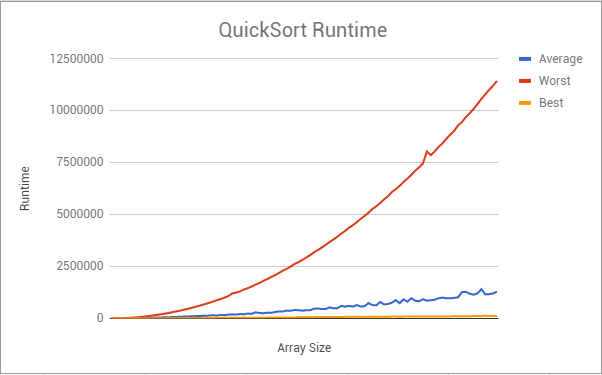

###### Crayoyo
###### Brian Lin, Aleksandra Koroza, Isaac Jon  
###### APCS2 pd2
###### L01 -- What Does the Data Say?
###### 2018-03-03

# Hypothesis
*The Best Case Scenario and Average Case Scenario for QuickSort have O(nlogn) runtime while the Worst Case Scenario for QuickSort has a O(n^2) runtime.*

# Background 
The Mechanics of Our Algorithm: 
1) Given an array, partition the array with the range containing all of the elements (left-index is 0 and right-index is the    length of the array - 1) and the pivot position at the first element. 
2) Set the value of the new pivot position as the return value of Step 1 
3) If the left index is less than the right index, use the new value in Step 2 to partition the "left-half" of the array. The    left-index and the pivot position - 1 are the boundaries of the partition. Then, partition the "right-half" of the            array. Pivot Position + 1 and the right-index are the boundaries of the partition. 
4) If the right-index is greater than the left-index, that means the array has been sorted. If so, do nothing. 

Best Case: Odd-sized array where the pivot position is at the middle of the array {(right+left)/2}  
Average Case: Pivot position is left  
Worst Case: Even-sized array of ascending order and pivot position is left  

# Experiment methodology
For our experiment, we wanted to test the runtime of our algorithm as the size of the array increases. 
First, we created a method called getAverage(). Our QuickSort.java contained a method called buildArray() which we also used. This method creates an array with random elements. Its parameters allow us to change the size of the array and include the max value of the array if we want to make a new one.  

Our method getAverage() returned the average time, in nanoseconds, it takes for the sort algorithm to sort a given array. Average runtime is computed by repeating each quickSort() operation 1,000 times and dividing by number of iterations.

Procedure:
1) Start with an array of size 100 created by buildArray()
2) Find the average runtime of the best, average, and worst case for the array.
3) Repeat step 2 on each matrix with size increasing by 100, up to size 10,000.
4) Input the data into the csv file through a terminal redirect

# Results
  
Link to GoogleSheets: https://docs.google.com/spreadsheets/d/1ZFbmSS7K8IxqbPZelPKsaUUIa1jW6-LSNS4_TiEpuFc/edit#gid=0

# Conclusion
Based on our results, we can conclude that the QuickSort algorithm is indeed O(nlogn) runtime for the best and average cases while it has O(n^2) runtime for the worst cases. The value of the pivot position is what best determines the runtime of algorithm. The size of the array can also be taken into consideration since that would result in more partitions that need to be run.
